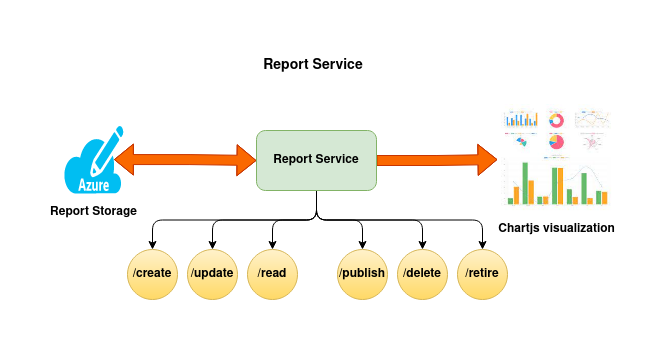
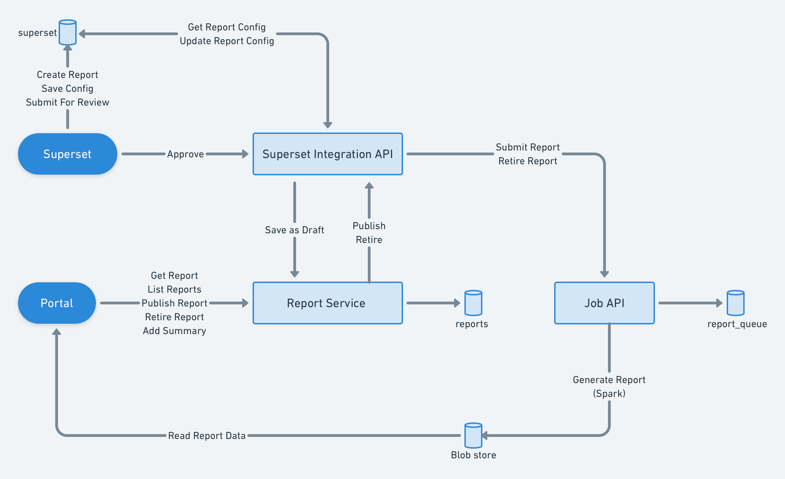

# sunbird-report-service
Report Service
The Report Service provides capabilities to create and consume reports on the front user interfaces/user apps. The reports are rendered and managed through report configurations.

## Architecture

### Key Features:
Scalable rendering: The report configuration and data files are rendered from a cloud storage or a CDN which supports large number of concurrent users accessing the reports from the front end user interface.

Easy to update: The update api allows the report configurations to be updated requiring no downtime for the reporting system.

Decoupling: Visualization (charts) and data are decoupled. This allows the system to reuse the same data for multiple visualizations.

## Local developement steps

## Reference documents
* [Wiki reference for report-service](https://project-sunbird.atlassian.net/wiki/spaces/UM/pages/3267264528/Hawkeye+Reports)  
* [Report service - Gitbook documentation](https://obsrv.sunbird.org/previous-versions/sb-5.0-version/learn/product-and-developer-guide/report-service)  
* [Report Configurator](https://obsrv.sunbird.org/previous-versions/sb-5.0-version/learn/product-and-developer-guide/report-configurator)  
* [Report configuration guidelines](https://4099675733-files.gitbook.io/~/files/v0/b/gitbook-x-prod.appspot.com/o/spaces%2FttPCtrHlLrl4MRuGlakt%2Fuploads%2Fgit-blob-151cd2eb14351a947ad35925f0fea40a0de77fda%2FSB%20Report%20Configuration%20Guide.pdf?alt=media&token=510629de-133a-4007-a0fd-0dda16b04a06)  

## API documentation
https://app.swaggerhub.com/apis/hawkeye7/hawkeyeNew/1.0.0#/info

## Devops Repo config changes for any new environment add/delete for the service
https://github.com/project-sunbird/sunbird-devops/blob/release-6.0.0/ansible/roles/stack-sunbird/templates/sunbird_report-service.env

All the service configuration values will be take from the above while deploying the service
